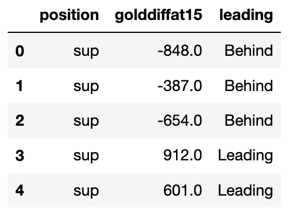
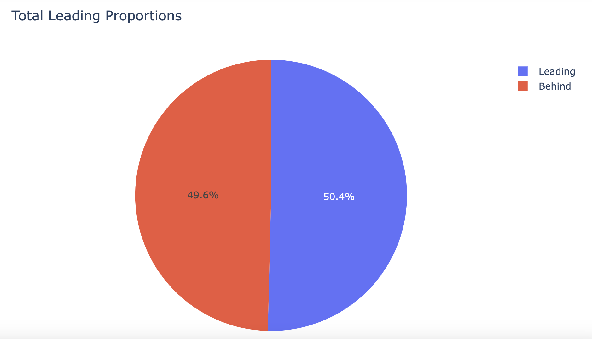
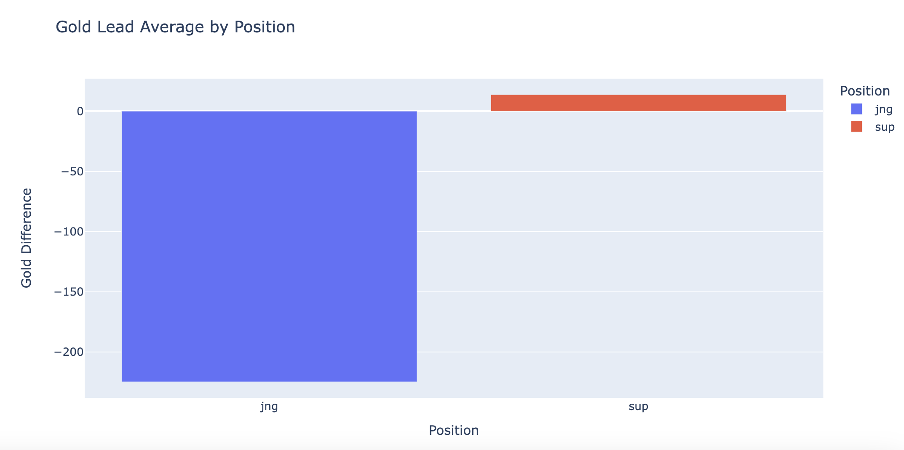
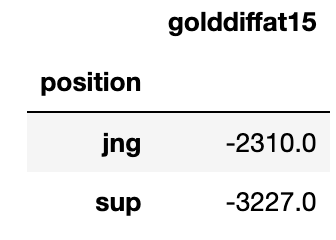

# DSC80 FA23 Project 3
This repository serves the primary purpose of hosting a Jekyll GitHub Page for the project 3 report from DSC80_FA23.

Names: \
Leo Shi A17033789 \
Eric Gu A16817621

 
Question: Is the champion Rell more likely to have a gold lead at 15 minutes as a Jungler than a Support given any match in the pro series?

# Introduction
Our dataset is chosen from all the [League of Legends Professional games in 2023](https://oracleselixir.com/tools/downloads). The dataset consists 129480 rows and 123 columns in total. Each match consists of 12 rows with 10 players' personal statistics in the first 10 rows and the team statistics in the last 2 rows. Since the champion Rell has become more and more popular in professional games as both a Jungler and a Support (two positions in a game of Leage of Legends), we would like to know more about the performance of Rell in professional games as the two roles, especially in the first 15 minutes of a game, which is usually a crucial part of the game for experience and gold gaining. Thus, we decided to propose the question “Is the champion Rell more likely to have a gold lead at 15 minutes as a Jungler than a Support?”. Through this experiment, the League of Legends pro-game audience can understand which role Rell is likely to perform better at in any given pro game.

To answer the question “Is the champion Rell more likely to have a gold lead at 15 minutes as a Jungler than a Support?”, we decided to perform data cleaning of the original dataset and form a new dataset that better answers the question. Among all the 2074 matches containing the champion Rell, only 1854 have valid(non NaN) data in the `golddiffat15` column, which we would like to consider. Thus, the new dataset consists of 1854 rows and 3 columns. The three columns are `position`, `golddiffat15`, and `leading`. We chose these three columns because it shows the position of Rell used by the player, the gold difference between Rell and its opponent at 15 minutes of a game, and whether they are leading or not. The gold difference between Rell and its opponent is what defines whether the Rell player performs better than its opponent. Each row represents each individual Rell match statistics. 

### Description of Columns
“position” is ‘jng’ when Rell is played as a Jungler and ‘sup’ when Rell is played as a Support.
`golddiffat15` is the amount of gold difference between the player who plays Rell and the opponent at the 15 minutes of a game.
‘leading’ is ‘Leading’ when the Rell player has positive `golddiffat15` value and ‘Behind’ when the Rell player has non positive `golddiffat15` value. This was created after `golddiffat15` was collected.

# Cleaning and Exploratory Data Analysis
### Data Cleaning 
In order to solve our question, we decided to keep relevant columns that helps answer the question: `position` and `golddiffat15`, and the relevant rows that only consist of all match data related to the Champion Rell, which the value in the champion column is equal to ‘Rell’. This makes each row represent a single Rell match without repetition (in a game of League of Legends, all playing champions must be unique). After getting all match information related to Rell, we notice that there are some empty values in `golddiffat15` that are not recorded in the original dataset. Since we can’t know the gold difference from the missing data, we decide to clean up and remove all empty `golddiffat15` data and keep the rest meaningful data, which makes the row number change from 2047 to 1854. In order to help us faciliate data managing and understand more directly whether the Rell match has a gold lead or not, we add another column named `leading`, which has value `Leading` when the Rell player has positive `golddiffat15` value and `Behind` when the Rell player has non-positive `golddiffat15` value. 

Here are the head of the cleaned DataFrame:

### Univariate Analysis

This is a pie chart showing the total leading proportion of all the Rell in 2023 Professional matches. 50.4% of the Rell matches have a gold lead in the first 15 minutes, and 49.6% of the Rell matches don’t have a gold lead in the first 15 minutes. We can notice that Rell almost has a tie gold lead proportion at 15 minutes of a game.

### Bivariate Analysis

This is a bar chart showing the gold lead average by position of all Rell in 2023 Professional matches. We can notice that Rell plays as a Support has a higher gold difference toward its opponent than as a Jungler at the 15 minutes of a game. Rell plays as Support tends to have a positive gold difference toward its opponent at the 15 minutes of a game and a negative gold difference toward its opponent at the 15 minutes of a game as a Jungler.

### Interesting Aggregates

This `groupby` shows the most gold difference that the Rell player is behind towards its opponent (of the corresponding position) at the 15 minutes mark for both position. It is interesting to see that the Support Rell in one match is behind by 3227 gold, **which is a lot!!!**

# Assessment of Missingness

### NMAR Analysis

### Missing Dependency

# Hypothesis Testing
